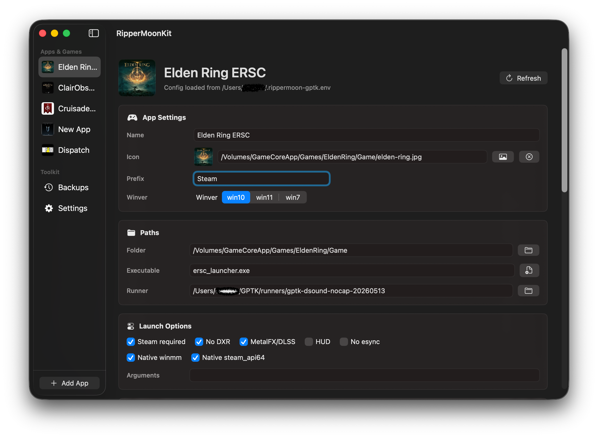

# Elden Ring Seamless Coop / ERSC

This page documents the working launch shape for ERSC when it needs Steam running and Spacewar/AppID 480 available.


This is a proof-of-concept capture from the RipperMoonKit Elden Ring profile. It shows the game running through Apple Game Porting Toolkit 3 with the HUD visible.

## Tested Content Layout

This ERSC workflow was tested with a pre-installed offline/non-Steam Windows game folder copied into the target `Games` directory.

Use the installed game folder from a Windows PC:

```text
$GPTK_EXTERNAL_ROOT/Games/EldenRing/Game/
    eldenring.exe
    ersc_launcher.exe
    SeamlessCoop/
```

Do not use the original installation files as the runtime source for this flow. In this GPTK build, the installer path is fragile; the reliable path was copying the already-installed `Game` folder and launching from there.

This repository does not include game files, saves, Steam data, Wine prefixes, or runtime blobs.

## Example Launcher Profile



The GUI profile keeps the Elden Ring folder, Steam prefix, runner, and launch options in one place so the setup is easier to repeat.

## Gameplay Capture


This second capture is included to show the setup during active gameplay. It is not a promise of exact performance on every Mac.

## Path Variables

Set these for your machine:

```zsh
export ER_GAME_DIR="$GPTK_EXTERNAL_ROOT/Games/EldenRing/Game"
export ER_LOG="$GPTK_HOME/logs/ERSC-steam-prefix.log"
```

If you use the Golden Pot lobby fix, point `GPTK_WINE_HOME` at the patched GPTK runner:

```zsh
export GPTK_WINE_HOME="$HOME/GPTK/runners/gptk-dsound-nocap-20260513"
```

That runner is a stock GPTK runner with only Wine DirectSound capture disabled. It prevents Steam Voice from locking the process when ERSC opens the world to wanderers. See [steam-voice-capture-fix-2026-05-13.md](steam-voice-capture-fix-2026-05-13.md).

## Launch Sequence

Start Steam first:

```zsh
gptk-steam --log
```

In another terminal, make sure AppID 480 is launched or initialized when your ERSC setup depends on it:

```zsh
gptk-steam --log -applaunch 480
```

Then launch ERSC from the game folder using the same `Steam` prefix:

```zsh
cd "$ER_GAME_DIR"
WINEDLLOVERRIDES='winmm=n,b;steam_api64=n,b' \
  gptk-launch --prefix Steam --set-winver win10 --no-dxr --log-file "$ER_LOG" -- ./ersc_launcher.exe
```

## Full Placeholder Commands

These commands use literal placeholders for GitHub readers. Replace `USERNAME` with your macOS user name and replace `EXE PATH` with the folder that contains `ersc_launcher.exe` and `eldenring.exe`.

Start Windows Steam with the tested DirectSound no-capture runner:

```zsh
env GPTK_WINE_HOME="/Users/USERNAME/GPTK/runners/gptk-dsound-nocap-20260513" \
  /Users/USERNAME/bin/gptk-steam --no-log
```

Launch ERSC from the copied game folder:

```zsh
cd "EXE PATH"
env GPTK_WINE_HOME="/Users/USERNAME/GPTK/runners/gptk-dsound-nocap-20260513" \
  WINEDLLOVERRIDES='winmm=n,b;steam_api64=n,b' \
  /Users/USERNAME/bin/gptk-launch \
    --prefix Steam \
    --set-winver win10 \
    --no-dxr \
    --log-file "/Users/USERNAME/GPTK/logs/ERSC-dsound-nocap.log" \
    -- ./ersc_launcher.exe
```

Stop Steam and the Steam-prefix game processes:

```zsh
/Users/USERNAME/bin/gptk-steam --kill
```

Optional Spacewar/AppID 480 launch when a setup needs it initialized explicitly:

```zsh
env GPTK_WINE_HOME="/Users/USERNAME/GPTK/runners/gptk-dsound-nocap-20260513" \
  /Users/USERNAME/bin/gptk-steam --no-log -applaunch 480
```

## Why Same Prefix Matters

Steam API calls depend on the running Steam client's IPC state. If Steam is running in one prefix and ERSC launches from another prefix, the game may not see the same named pipes and process environment.

The working model is:

```text
Steam prefix:
  steam.exe
  steamwebhelper.exe
  ersc_launcher.exe
  eldenring.exe
```

## Esync Rule

If Steam's Wine server is already running with esync enabled, do not launch ERSC with `--no-esync`.

An esync mismatch looks like:

```text
Server is running with WINEESYNC but this process is not
```

Leave esync enabled for ERSC in that case.

## Useful Checks

Process check:

```zsh
pgrep -af 'steam.exe|steamwebhelper|ersc_launcher|eldenring.exe|wineserver'
```

Latest logs:

```zsh
ls -lt "$GPTK_HOME/logs" | head
tail -n 120 "$ER_LOG"
```

Crash dumps:

```zsh
ls -lt "$ER_GAME_DIR/SeamlessCoop/crashdumps/reports" | head
```

Layout check:

```zsh
examples/check-ersc-layout.zsh.example
```

No-capture launch example:

```zsh
examples/ersc-launch-dsound-nocap.zsh.example
```
