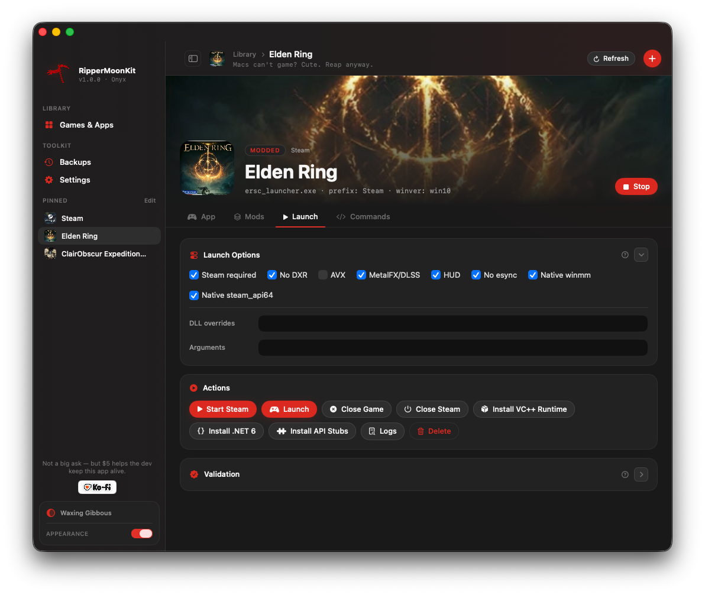

# SwiftUI Launcher

RipperMoonKit now includes a native SwiftUI launcher target:

```text
RipperMoonKitLauncher
```

The launcher reads `~/.rippermoon-gptk.env`, shows a library grid of configured apps/games, opens each app into its own launch settings, validates that app's folder layout, starts Windows Steam when the profile requires it, closes the selected game without stopping Steam, installs Microsoft Visual C++ runtime packages per prefix, and exposes install, update, uninstall, backup, and rollback actions.




The app is organized around a library of individual games and apps. Pick **Games & Apps** to see the grid, then open a game tile to adjust that profile's icon, folder, prefix, runner, and launch options. Steam appears in the library as its own app, while still being available as a dependency for games that need the running Steam client.

Large technical sections such as resolved commands, validation, and ModEngine configuration can collapse. Section help and hover tooltips explain what each setting does and why it matters.

## First-Run Setup

The first-run setup keeps required GPTK work separate from optional Steam waiting time:

1. The app prepares the bundled toolkit source and helper scripts.
2. If GPTK 3.0 is missing, the app pauses and sends the user to Apple's download page.
3. After the GPTK DMG is mounted, the app installs the local GPTK runner/runtime and verifies them.
4. Steam installation starts in the background.
5. The app can move to **You're all set** while Steam continues installing.

The finished screen tells the user what to do next:

- sign into Steam from the Steam profile when Steam is ready;
- set game-folder paths;
- use copied, already-installed Windows game folders, not installer files;
- add a TheGamesDB API key if they want cover art.

While Steam is still installing, the app shows that state instead of claiming Steam is ready. The background installer writes a log under:

```text
$GPTK_HOME/logs/steam-install-background-YYYYmmdd-HHMMSS.log
```

## Build

```zsh
cd RipperMoonToolKit
swift build
```

## Run

```zsh
cd RipperMoonToolKit
swift run RipperMoonKitLauncher
```

## Install Local App

Build and install a local `.app` bundle:

```zsh
cd RipperMoonToolKit
zsh scripts/install-gui-app.zsh
```

Default install path:

```text
~/Applications/RipperMoonKit Launcher.app
```

Install to a custom path:

```zsh
zsh scripts/install-gui-app.zsh "$HOME/Desktop/RipperMoonKit Launcher.app"
```

If a previous app exists, the script backs it up under:

```text
$GPTK_HOME/backups/gui-app-YYYYmmdd-HHMMSS.noindex
```

The backup copy is stored as `.app.backup` so Spotlight does not show old launcher backups as separate installed apps.

## Apps And Games

The sidebar opens the library, backups, and settings. The library grid is centered on user-owned app/game profiles. Each profile stores its own:

```text
name
prefix
game folder
executable
icon path
runner path
Windows version
Steam requirement
DLL overrides
DXR/esync/HUD/MetalFX-DLSS toggles
validation files
launch command preview
```

Use **Add Game** to create another app/game profile. Steam games found in the configured Steam library can appear as Steam-backed game tiles and launch through Steam AppID commands.

Each profile can point at its own icon image. The library tile, the app settings preview, and the large square icon in the page header use that profile icon when configured. This is intentionally a user-selected image path, because the best icon is not always embedded in the Windows `.exe`.

The MetalFX/DLSS toggle is for games that expose DLSS in their own graphics menu. It adds `--metalfx` and prefers GPTK's built-in `nvapi64` and `nvngx` bridge DLLs for that launch.

The **Close Game** action uses Wine `taskkill` against the selected profile's executable name. For the default ERSC profile, it also targets `eldenring.exe`. It does not stop the Steam prefix or run `wineserver -k`.

The Steam profile includes **Install Spacewar**, which launches Steam AppID 480 once. Let Steam finish installing Spacewar and any first-run redistributables, close Spacewar, then launch co-op profiles such as Elden Ring ERSC from their own profile.

The per-profile **Install VC++ Runtime** action runs `gptk-vcrun --prefix PROFILE_PREFIX`. Settings > Maintenance also has a global install action that runs `gptk-vcrun --all`.

The sidebar **Report Test Result** button copies a structured tester report and opens a prefilled GitHub issue. GitHub may still require sign-in before submission; the copied report can also be pasted into Reddit, Discord, email, or another feedback form.

## Default ERSC Profile

The first profile is the tested Elden Ring ERSC path:

```text
prefix: Steam
winver: win10
runner: $HOME/GPTK/runners/gptk-dsound-nocap-20260513
dll overrides: winmm=n,b;steam_api64=n,b
game folder: $GPTK_EXTERNAL_ROOT/Games/EldenRing/Game
```

The launcher repairs this profile on load and immediately before starting Steam or ERSC. If the profile is empty, missing its required ERSC options, or points back to stock GPTK while the patched runner exists, the GUI restores the Golden Pot-safe defaults.

The launcher emits the same command line that can be run manually:

```zsh
cd "EXE PATH"
env GPTK_WINE_HOME="/Users/USERNAME/GPTK/runners/gptk-dsound-nocap-20260513" \
  WINEDLLOVERRIDES='winmm=n,b;steam_api64=n,b' \
  /Users/USERNAME/bin/gptk-launch \
    --prefix Steam \
    --set-winver win10 \
    --no-dxr \
    --log-file "/Users/USERNAME/GPTK/logs/ERSC-gui.log" \
    -- ./ersc_launcher.exe
```

## Elden Ring Mod Manager

The Elden Ring profile now has a **Mod Manager** panel for the ModEngine 2 plus Item and Enemy Randomizer workflow. This treats ModEngine, Randomizer, and Seamless Coop as tools attached to Elden Ring, not as separate games in the library.

Expected copied game layout:

```text
Game/
  eldenring.exe
  ersc_launcher.exe
  SeamlessCoop/
    ersc.dll
    ersc_settings.ini
  ModEngine2/
    modengine2_launcher.exe
    launchmod_eldenring.bat
    config_eldenring.toml
    mod/
    randomizer/
      EldenRingRandomizer.exe
```

The **Install ModEngine + Randomizer** action installs .NET 6 Desktop Runtime into the randomizer tools prefix, then runs RipperMoonKit's native profile helper. That helper clones or updates the `elden-randomizer-coop` setup reference repo under `$GPTK_HOME/tools`, opens the ModEngine/Randomizer/Seamless download pages, scans the reference repo's `inputs/` folder for ZIPs, installs what it finds, and writes the current-machine ModEngine files.

On macOS, the randomizer GUI is launched as a tool, not as the game. RipperMoonKit prefers **Wine Staging 11.8** at `/Applications/Wine Staging.app/Contents/Resources/wine` when it is installed, because GPTK/Wine 7.7 can stack-overflow in WinForms UIAutomation before the randomizer window appears. Elden Ring itself still launches through the normal GPTK game runner.

This intentionally does not run `setup.bat` or `ercoop.ps1` on macOS. Those files call Windows PowerShell, which is not present in a normal GPTK prefix. The native helper mirrors the setup behavior with macOS tools.

The separate **Install .NET 6** action is available when you only need to repair the randomizer runtime. It runs:

```zsh
gptk-dotnet6 --prefix PROFILE_TOOLS_PREFIX
```

The default download is Microsoft's .NET Desktop Runtime 6 channel URL:

```text
https://aka.ms/dotnet/6.0/windowsdesktop-runtime-win-x64.exe
```

.NET 6 is end-of-life, but the randomizer is built for it, so this is installed only inside the selected Wine prefix.

The **Install Mod Zips** action is the manual version. It accepts selected downloaded ZIPs for ModEngine 2, Seamless Coop, Item and Enemy Randomizer, and optionally Anti Cheat Toggler. It identifies them by marker files inside the ZIP, extracts them into the expected folders, preserves an existing `SeamlessCoop/ersc_settings.ini`, and moves any existing `ModEngine2/randomizer/` folder to a timestamped backup before replacing it.

The **Prepare Mod Files** action writes or repairs:

```text
ModEngine2/config_eldenring.toml
ModEngine2/launchmod_eldenring.bat
```

Existing files are copied to timestamped `.bak` files before being replaced. The generated TOML uses relative paths for the local setup:

```toml
external_dlls = [
    "../SeamlessCoop/ersc.dll"
]

mods = [
    { enabled = true, name = "default", path = "mod" },
    { enabled = true, name = "randomizer", path = "randomizer" }
]
```

The launch bat uses the current Mac path converted to Wine's default `Z:\...` view. It does not preserve another Windows machine's drive letters such as `G:`.

The **Backup Mod State** action creates a rollback ZIP of `ModEngine2`, `SeamlessCoop`, and the root helper executables before risky changes.

The **Import From Friend** action accepts an exported co-op/randomizer friend kit, stages the bundled ZIP files, copies the shared `.randomizeopt`, and applies the shared Seamless password without printing it.

Use the panel in this order:

1. Click **Install ModEngine + Randomizer** to clone/update the setup reference and open the download pages.
2. Put the downloaded ZIPs into `$GPTK_HOME/tools/elden-randomizer-coop/inputs`, then run the action again; or click **Install Mod Zips** and choose the ZIPs manually.
3. Click **Prepare Mod Files** if you changed paths or want to regenerate the config/bat.
4. Click **Run Randomizer**, import the `.randomizeopt` file, and click Randomize.
5. Start Steam if the profile needs Steam/Spacewar.
6. Click **Launch Modded**.

The regular **Launch** button also uses ModEngine when **Use ModEngine launch** is enabled.

The randomized files are mounted by ModEngine at launch time. If you launch the same Elden Ring folder without ModEngine, randomization stops appearing. That is expected: it means the randomized profile is isolated to the ModEngine launch path.

On macOS/external volumes, ZIP extraction or Finder copies can create AppleDouble files named `._Something.xml`. These are binary metadata sidecars, not real Randomizer definitions. The installer removes `._*`, `.DS_Store`, and `__MACOSX` entries after extraction so the Randomizer does not try to parse sidecars as XML.

## Tool Credits

RipperMoonKit's Elden Ring Mod Manager depends on user-downloaded community tools and does not redistribute their files:

- [ModEngine 2](https://github.com/soulsmods/ModEngine2) supplies the mod loader used by **Launch Modded**.
- [Elden Ring Seamless Co-op / ERSC](https://www.nexusmods.com/eldenring/mods/510) supplies the co-op DLL and launcher used by the ERSC profile.
- [MoonTheRipper/elden-randomizer-coop](https://github.com/MoonTheRipper/elden-randomizer-coop) is the setup reference repo used to mirror the Windows workflow in native macOS scripts.
- Elden Ring Item and Enemy Randomizer is launched as a separate .NET tool through the tools prefix.

## Design Direction

The interface follows current Apple platform conventions:

- `NavigationSplitView` for a source list and focused detail pane.
- SF Symbols for actions and state.
- System materials and standard controls instead of custom chrome.
- Compact dashboard panels with validation, command previews, and rollback state.
- A compatibility-profile model so other games can be added without hard-coding one-off launchers.

The Roadmap section is intentionally not part of the app UI. Roadmap details remain in GitHub documentation.

The logo resource is:

```text
Sources/RipperMoonKitLauncher/Resources/RipperMoonKitLogo.jpg
```

When `scripts/install-gui-app.zsh` packages the local app, it also crops this image into a square macOS icon set and writes:

```text
~/Applications/RipperMoonKit Launcher.app/Contents/Resources/RipperMoonKitLogo.icns
```

The app bundle points `CFBundleIconFile` at that icon so Finder, Dock, and app switcher use the same artwork as the in-app logo.

It was copied from the local image:

```text
~/Pictures/Wallpaper Screen/wallpaperflare.com_wallpaper (31).jpg
```

## First Run Setup

The app shows the setup guide only when the toolkit is not ready and the guide has not already been dismissed. A missing path is still shown in the guide when opened, but clicking **Done** suppresses automatic repeats.

The setup guide has actions for:

```text
Install Toolkit
Install GPTK
Open Apple GPTK Page
```

The GPTK action runs the installer with `RIPPERMOON_OPEN_GPTK_PAGE=1`, so if GPTK is not present it opens Apple's page, watches `/Volumes` and `~/Downloads`, and continues when the user mounts or downloads GPTK media.

GPTK detection accepts the configured `GPTK_WINE_HOME`, a copied GPTK app under `$GPTK_HOME/apps`, Apple's `/Applications/Game Porting Toolkit.app`, and patched runners under `$GPTK_HOME/runners`.

## Path And Drive Settings

The Settings page contains editable paths:

```text
GPTK Home
Prefix Root
Games Root
External Root
Steam Library
Toolkit Source
```

It also includes a Drive Mappings editor. Users can add any drive letter except `C`, choose a host folder, and save the result back to `GPTK_DRIVE_MAPS` in `~/.rippermoon-gptk.env`.

## Cover Art

RipperMoonKit can fetch real box art for a profile from [TheGamesDB](https://thegamesdb.net), a free community game-art database. The placeholder gradient on a tile is replaced once a cover is set.

### Add an API key

Cover lookup needs a TheGamesDB API key. Settings has a **Cover Art · TheGamesDB** card with:

```text
API Key   editable field
Save Key  persists the key to local app storage
```

Get a free key at [thegamesdb.net](https://thegamesdb.net), paste it into the field, and click **Save Key**. The status line reads *Cover search ready* once a key is set, or *No key set — cover search is disabled* when it is empty.

The key is stored locally on each machine — it is never written into the repository or an exported build. On first run the field is seeded from the optional `GPTK_TGDB_API_KEY` value in `~/.rippermoon-gptk.env`; after that the in-app Settings value is the source of truth.

### Find a cover

Open a game profile, go to the **App** tab, and click the photo button next to the **Icon** field. The **Find Cover Art** sheet searches TheGamesDB by the profile name, shows matching box art with release years, and sets the chosen image as the profile icon.

Downloaded covers are cached under:

```text
$GPTK_HOME/covers
```

The selected cover is used everywhere the profile icon appears — the library tile, the library hero banner, the game detail header, and the sidebar.

## Next GUI Work

Planned app work:

- Sign and notarize release `.app` builds.
- Add launch status checks for long-running Steam/game processes.
- Add safer restore flows for optional user-selected save snapshots.
- Add import/export for app profile presets.

## Maintenance Buttons

The Settings view includes:

- **Install Toolkit**: runs `./install.zsh --skip-deps` and creates a rollback backup first.
- **Install GPTK**: runs the full installer with `RIPPERMOON_OPEN_GPTK_PAGE=1`; if GPTK is missing, Apple's GPTK page opens and the installer waits for the DMG.
- **Check for Updates**: checks the latest public GitHub release. When a newer version is available, the sidebar shows an update notice that sends users to Settings > Maintenance.
- **Update From GitHub**: fetches `origin/main`, fast-forwards the repo, reinstalls toolkit scripts, rebuilds the local `.app`, then closes and reopens the packaged app.
- **Uninstall Toolkit**: removes toolkit scripts and the app. Configs and Wine prefixes/saves are kept unless their checkboxes are enabled.

The uninstall defaults are intentionally conservative:

```text
keep ~/.rippermoon-gptk.env
keep $GPTK_PREFIX_ROOT
keep games, Steam libraries, GPTK runtimes, patched runners, and backups
```
